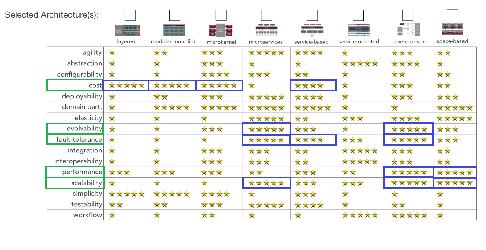

[> Home](../graduate_project.md)

---

# Выбор архитектурного стиля

## Статус

Принято

## Контекст

Необходимо провести анализ архитектурных характеристик требуемых сервису и выбрать архитектурный стиль наиболее 
соответствующий этим характеристикам.

## Решение
Характеристики важные для системы
- QA001: Масштабируемость
- QA002: Производительность
- QA003: Расширяемость
- QA004: Параллелизм
- QA005: Отказоустойчивость
- QA006: Стоимость

Критичными для архитектуры являются следующие три характеристики
- QA001: Масштабируемость
- QA002: Производительность
- QA005: Отказоустойчивость
- QA006: Стоимость

В соответствии с данным набором характеристик и используя матрицу
[DeveloperToArchitect.com](https://www.developertoarchitect.com/downloads/worksheets.html) лучшим сочетанием необходимых
нам качеств является событийно-ориентированный архитектурный стиль.

## Последствия

**Позитивные:**

- 4 из 6 характеристик на максимуме.

**Негативные:**

- Стоимость решения на среднем уровне 3 из 5. Можем не уложиться в имеющиеся у нас ресурсы. 

---

[> Home](../graduate_project.md)