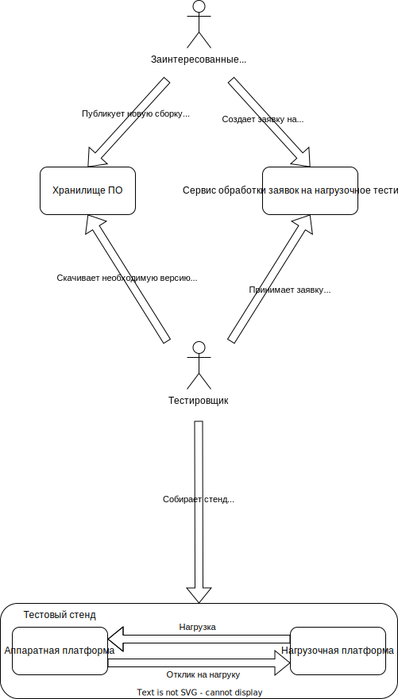

# Описание проблемы
## Контекст
Компания разрабатывает большое кол-во типов активного сетевого оборудования (коммутаторы, маршрутизаторы, 
координаторы и т.д.) построенных на различных аппаратных платформах (различаются типами и количеством сетевых интерфейсов
(1G, 10G, 100G), архитектурой и производительностью процессора, количеством оперативной памяти и т.д.). 
Программное обеспечение устанавливаемое на аппаратную платформу определяет к какому типу сетевого оборудования будет 
относиться конечное сетевое устройство. От типа сетевого устройства зависит набор нагрузочных тестов, которые должны быть
проведены на нем, а от аппаратной платформы зависят параметры проводимых тестов. Имеется сервис с помощью которого 
заинтересованные люди могут разместить заявку на нагрузочное тестирование по определенной методике, определенной сборки 
программного обеспечения на определенной платформе. Заявку выполняет тестировщик, он резервирует нагрузчик, собирает стенд 
из нагрузчика, тестируемого устройства и другого оборудования тестового окружения, устанавливает на тестируемое 
устройство необходимую сборку программного обеспечения, проводит тестирование в соответствии 
с выбранной методикой и публикует данные на сервисе. Количество оборудования использующееся в качестве нагрузчиков 
ограничено и имеет высокую цену за комплект и за лицензии на используемый функционал. На текущий момент также имеется 
vendor locking так как производители данного оборудования больше не представлены на нашем рынке, что еще больше повышает 
стоимость данного оборудования.

## Бизнес драйверы <!--- Архитектурные драйверы --->

- Количество вариантов тестируемых устройств увеличивается, по этой причине не хватает Нагрузчиков для тестирования 
этого оборудования. Приобретение дополнительных комплектов Нагрузчиков слишком дорого и проблематично из-за 
vendor-locking.
- Большие затраты человеческих ресурсов тестировщиков на тестирование
- Большое время обработки заявки на тестирование (недели, доходило до месяцев) 

## Бизнес цели
- Уменьшить время обработки заявок на тестирование до суток и менее
- Сделать нагрузочное тестирование сетевых устройств постоянным и включить их в общий пайплайн CI/CD
- Уменьшить и/или исключить затраты времени тестировщиков на тестирование
- Для преодоления vendor-locking и снижения себестоимости Нагрузчиков, разработать собственные Нагрузчики средства 
нагрузочного тестирования 

## Ограничения технологические и бизнесовые
- Разработка Нагрузчиков проводится на тех же аппаратных, или немного более производительных, платформах, 
что и продукты компании

# Описание требований
### Требования к разрабатываемому Нагрузчику

- Вид трафика. 
  - UDP. Потоки UDP-трафика с варьированием размера пакета.
  - Internet Mix ( IMIX ). Взвешенная смесь потоков UDP-трафика, моделирующая типовой Internet-трафик ( по частоте и размеру пакетов ).
- Измеряемые показатели. 
  - Throughput. Пропускная способность - кол-во байт данных, переданных в единицу времени. Измеряется для UDP-трафика и смеси трафика эмуляции сетевых приложений.
  - PPS. Packets per Second - кол-во пакетов переданных в единицу времени.
  - Delay. Задержка передачи пакета данных от источника к получателю.

- Генерация и анализ трафика (без сохранения состояния), L2-L3  
  Генератор stateless-трафика позволяет оценивать основные показатели производительности сети и сетевого оборудования:
  - Throughput – пропускная способность сети, измеренная в битах информации, передаваемых в единицу времени.
  - PPS – Packets per Second, количество пакетов, передаваемых в единицу времени, как правило показатель измеряется на пакетах (фактически кадрах) размером 64 Б.
  - Delay –сетевая задержка, вносимая устройствами, через которые проходит тестовый трафик.

- Многоконтурность  
Продукт поддерживает возможность генерации трафика через несколько контуров одновременно (контур – парта портов генерации – анализа трафика). Появляется возможность полной загрузки актуальных топовых моделей xF и HW5.

- Многоарендность  
Несколько пользователей работают одновременно независимо друг от друга (влияния на результаты параллельного тестирования нет). Появляется возможность тестировать несколько стендов одновременно. Актуально для полной утилизации возможностей Продукта при тестировании средних продуктов линейки HW5, xF, KB и низкоскоростных

- Вариабельность IP-адресации  
Unique и High entropy

- Скорости сетевых интерфейсов  
Ethernet: 1G, 10G

- Точность измерение задержек
десятки микросекунд

- Погрешность измерения 1%

### Требования к системе автоматизации нагрузочного тестирования

Функционально система автоматизации тестирования должна заменить тестировщика

## Пользовательские сценарии
## Сценарии для атрибутов качества
# Описание решения
## Контекстная диаграмма
## Диаграмма контейнеров
## Диаграмма развертывания
## Диаграммы последовательности для пользовательских сценариев
# Лог архитектурных решений (ADL, ADR)