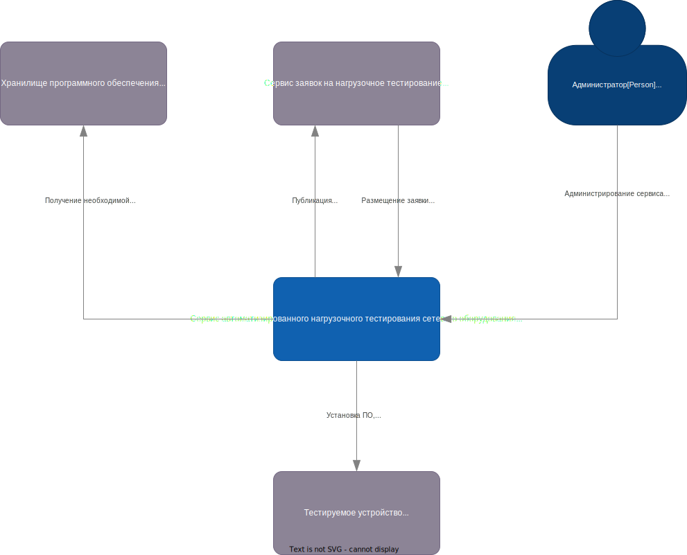
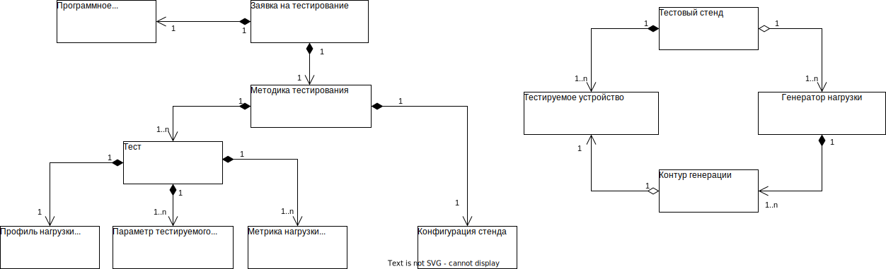
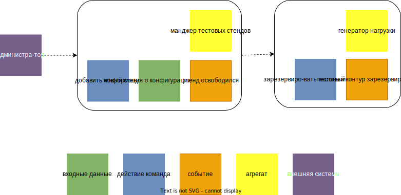

# Сервис автоматизированного нагрузочного тестирования сетевого оборудования

# Описание проблемы
## Основные понятия используемые в нагрузочном тестировании
Для описания бизнес контекста требований и предметной области необходимо сразу ввести используемые в нагрузочном 
тестировании понятия.

**Генератор нагрузки** - программно-аппаратный комплекс, генерирующий и анализирующий нагрузку для 
тестируемой системы.

**Тестируемое устройство** - программно-аппаратный комплекс, который будет подвергаться нагрузке.

**Оборудование тестового окружения** - дополнительное (в большинстве случаев пассивное) оборудование необходимое для 
коммутации сетевого оборудования.

**Контур генерации** - пара сетевых портов генерации – анализа нагрузки.

**Тестовый стенд** - сочетание генератора нагрузки, тестируемых устройств и оборудования тестового окружения.

**Профиль нагрузки** - определяет критически важные для конкретного теста сетевые параметры и варианты их изменения в 
течение теста. Примеры таких параметров: состав генерируемых сетевых протоколов, скорость генерации, размеры пакетов,
канальные и сетевые адреса и т.д

**Тест** — сценарий с заранее определенным набором параметров.

**Методика тестирования** — определяет состав тестового стенда и набор тестов проводимых по данной методике. Для каждого 
теста определяет конфигурацию тестируемого устройства, профиль нагрузки для генератора и собираемые метрики с тестируемых 
устройств и генератора.

**Метрики нагрузки** — определяемые в процессе нагрузочного тестирования характеристики нагружаемого устройства и 
генератора нагрузки.

**Пропускная способность (throughput)** - метрика определяющая количество байт данных, переданных в единицу времени.

**Фреймрейт (framerate)** - метрика определяющая кол-во пакетов/фреймов (зависит от уровня сеиевого протокола L2 L3) 
переданных в единицу времени.

**Односторонняя задержка (oneway delay)** - метрика определяющая время передачи пакета/фрейма от источника к получателю.

## Контекст
Компания разрабатывает большое кол-во типов активного сетевого оборудования (коммутаторы, маршрутизаторы, 
координаторы, фаерволы и т.д.) построенных на различных аппаратных платформах (различаются типами и количеством сетевых интерфейсов
(1G, 10G, 100G), архитектурой и производительностью процессора, количеством оперативной памяти и т.д.).   
Программное обеспечение устанавливаемое на аппаратную платформу определяет к какому типу сетевого оборудования будет 
относиться конечное сетевое устройство. Имеется сервис с помощью которого 
заинтересованные люди могут разместить заявку на нагрузочное тестирование по определенной методике, необходимой версии 
программного обеспечения на определенной аппаратной платформе. Заявку выполняет тестировщик, в соответствии с выбранной 
методикой, он резервирует генератор нагрузки, собирает тестовый стенд, устанавливает на тестируемое устройство 
необходимую версию программного обеспечения, проводит тестирование и публикует результаты тестирования на сервисе. 
Количество генераторов нагрузки ограничено и имеет высокую цену за комплект и за лицензии на используемый функционал. На 
текущий момент также имеется vendor locking так как производители данного оборудования больше не представлены на нашем 
рынке, что еще больше повышает стоимость данного оборудования.

## Бизнес драйверы

- Большое время обработки заявки на тестирование (недели, доходит до месяца)
- Большие затраты человеческих ресурсов на тестирование
- Количество вариантов тестируемых устройств увеличивается, по этой причине не хватает генераторов нагрузки для 
тестирования этого оборудования. Приобретение дополнительных комплектов генераторов нагрузки и лицензий для них слишком 
дорого и проблематично из-за vendor-locking.

## Бизнес цели
- Уменьшить время обработки заявок на тестирование до суток и менее
- Сделать нагрузочное тестирование сетевых устройств постоянным и включить их в общий пайплайн CI/CD
- Уменьшить и/или исключить затраты времени тестировщиков на тестирование
- Преодоление vendor-locking и снижения себестоимости генераторов нагрузки путем создания собственного генератора 
нагрузки реализующего простейшие, но более массовые по количеству заявок, типы сетевых профилей. Предусмотреть 
расширяемость для реализации более сложных сетевых профилей.   

## Ограничения технологические и бизнесовые
- Стек языков C/C++, Python, генератор нагрузки необходимо реализовать на основе аппаратной платформы применяемой для 
продуктов компании. 
- Установка программного обеспечения на тестируемые устройства осуществляется по протоколу PXE.
- Управление тестируемым устройством осуществляется командами по протоколу ssh.
- Сбор информации о состоянии тестируемого устройства осуществляется предустановленными скриптами сбора 
"параметров здоровья". Другое программное обеспечение на тестируемые устройства устанавливать запрещено так как оно 
может повлиять на производительность устройства

# Описание требований

## Бизнес требования
Сервис должен выполнять функции тестировщика по обработке заявок
- Сервис должен обеспечивать процесс выполнения заявки на нагрузочное тестирование
  (получение заявки, подготовка свободного стенда, выполнение нагрузочного тестирования, публикация результатов 
тестирования)
- Должен быть легко расширяемым для поддержки новых методик нагрузочного тестирования
- Необходимо добавить интерфейс для интеграции в сборочный конвейер компании, чтобы тестировать определенные сборки 
Программного обеспечения сетевого оборудования по их готовности
- Необходимо предусмотреть масштабирование при увеличении количества заявок
- Необходим интерфейс пользователя для администрирования и управления сервисом (состояние выполняемых заявок, 
возможность приостанавливать и/или досрочно завершать выполнение заявки, добавление нового стенда определенного 
конфигурации для выполнения заявки).

Создание собственного генератора нагрузки на основе аппаратных платформ применяемых для собственных продуктов компании.
- Генерация и анализ сетевого профиля состоящего из пакетов UDP протокола
- Вариативность размера пакетов. Размер пакетов должен быть фиксированным или задаваться шаблоном в котором описывается 
размер пакета и его доля во всем профиле.
- Вариативность скорости генерации. Должна задаваться различная скорость генерации пакетов. Вплоть до 100% загрузки 
текущего канала.
- Вариативность адресации. Должна поддерживаться генерация UDP пакетов с различным сочетанием канальных и сетевых 
адресов, а также UDP портов.
- Многоконтурность. Генератор должен поддерживать возможность генерации трафика через несколько контуров одновременно. 
Позволяет увеличить утилизацию ресурсов генератора. Появляется возможность тестировать высокопроизводительные 
устройства с несколькими сетевыми интерфейсами.
- Многоарендность. Позволяет проводить несколько тестов одновременно независимо друг от друга (влияния на результаты 
параллельного тестирования нет). Позволяет увеличить утилизацию ресурсов генератора. Появляется возможность использовать 
один генератор в нескольких тестовых стендах и выполнять несколько заявок на тестирование параллельно. 
- Измеряемые метрики. Позволяет измерять следующие метрики - пропускная способность, фреймрейт и односторонняя задержка.
- Должен поддерживать следующие типы сетевых интерфейсов 1G, 10G.
- Точность измерения односторонней задержки - десятки микросекунд.
- Погрешность измерения фреймрейта, односторонней задержки и пропускной способности не более 5%.
- Скорости генерации должна быть стабильна и ее разброс должен быть не более 5% от генерируемой скорости.
- Должен иметь API для возможности добавления генератора в схемы автоматизации.

## Стейкхолдеры
Заинтересованные стороны, ключевые участники:

- **SH1: Сервис заявок на нагрузочное тестирование** - источник заявок на нагрузочное тестирование и потребитель 
результатов тестирования.   
- **SH2: Хранилище программного обеспечения** - источник программного обеспечения, которое устанавливается на 
тестируемые устройства
- **SH3: Администратор** - лицо ответственное за администрирование системы, добавление новых конфигураций стендов
- **SH4: Тестируемое устройство** - программно-аппаратный комплекс нагрузочное тестирование, которого осуществляется 
разрабатываемой системой.

## Пользовательские сценарии
- UC001: Регистрация тестового стенда  
  - администратор регистрирует подготовленный стенд определенной конфигурации (SH3);
- UC002: Удаление тестового стенда  
  - администратор удаляет стенд (SH3);
- UC003: Обработка заявки на тестирование 
  - сервис заявок передает информацию о новой заявке на тестирование которую необходимо обработать (SH1);
  - система подготавливает стенд необходимой конфигурации
  - система генерирует необходимый профиль нагрузки
  - система собирает необходимые метрики
  - система публикует результат на сервисе заявок (SH1);
- UC004: Удаление заявки на тестирование  
  - администратор удаляет заявку на тестирование (SH3);
  - сервис заявок удаляет заявку на тестирование (SH1);
- UC005: Просмотр информации состояния заявок
  - администратор просматривает информацию о статусе заявки/заявок (SH3);
  - сервис заявок запрашивает информацию о статусе заявки/заявок (SH1);
- UC006: Просмотр информации состояния стенда
  - администратор удаляет заявку на тестирование (SH3);
  - сервис заявок удаляет заявку на тестирование (SH1);
- UC007: Добавление новой методики тестирования
  - администратор добавляет поддержку новой методики тестирования (SH3);
- UC008: Удаление поддержки методики тестирования
  - администратор удаляет поддержку методики тестирования (SH3);
- UC009: Просмотр информации о поддерживаемых методиках тестирования
  - администратор просматривает информацию о поддерживаемых методиках тестирования (SH3);
  - сервис заявок запрашивает информацию о поддерживаемых методиках тестирования (SH1);

## Сценарии для атрибутов качества
- QA001: Масштабируемость
  - в сервисе зарегистрирован один стенд. Регистрируются 10 заявок. Измеряется время выполнения заявок.
  - в сервис добавляют второй стенд такой же конфигурации. Регистрируются 10 заявок. Измеряется время выполнения.
  - время обработки 10 заявок на 2 стендах должно быть меньше в 1,8 раз чем на одном.
- QA002: Производительность
  - в сервисе зарегистрирован один стенд. Регистрируется 1 заявка. Измеряется время выполнения. Время выполнения должно 
быть на порядок меньше чем при выполнении той же заявки тестировщиком.
  - система должна генерировать профиль нагрузки мелкими пакетами в 64байта на максимальной скорости 10G интерфейса
- QA003: Расширяемость
  - добавление новой методики тестирования (без добавления новых сетевых протоколов в профиле нагрузки) должно занимать 
как можно меньше времени в идеале 1-2 суток, максимум 5 дней
- QA004: Параллелизм
  - выполнение заявок для по различным методикам должно выполняться параллельно на различных стендах
  - выполнение заявок для по одной методике, при наличии нескольких стендов подходящей конфигурации, должно выполняться 
параллельно
  - система должна поддерживать выполнение нескольких параллельных тестов на различных контурах одного генератора 
нагрузки
- QA005: Отказоустойчивость
  - неполадки и/или критические ошибки тестирования на одних стендах не должны влиять на тестирование на других стендах
- QA006: Стоимость
  - стоимость аппаратной платформы для генератора нагрузки должна быть равна стоимости платформы для разрабатываемых 
устройств или не превосходить эту стоимость более чем на 25%
  - для реализации системы имеем команду из 1 фронтенда, 1 Python разработчика, 3 C/C++ разработчиков. 
  - примерное время на разработку 1 год

# Описание решения
## Контекстная диаграмма
На приведенной ниже диаграмме контекста сервиса изображены ключевые пользователи системы и ее внешние зависимости:  

## Модель предметной области

Изначально было принято решение [ADR000](./adr/adr000-test_stand.md), что под каждую необходимую конфигурацию собирается
свой стенд и передается под управление разрабатываемому сервису. Данное решение легко масштабируется добавлением
дополнительных стендов необходимой конфигурации.

Тестовый стенд состоит из генератора нагрузки и одного или нескольких тестируемых устройств. Генератор нагрузки 
принадлежит системе и разрабатывается в рамках системы. В [ADR002](./adr/adr002-generator_framework.md) описано решение, 
которое позволит генерировать требуемую нагрузку.  

На диаграмме приведенной ниже представлена взаимосвязь основных сущностей нагрузочного тестирования.   

## Event storming
Согласно [ADR001](./adr/adr001-architecture_style.md) выбран событийно-ориентированный архитектурный стиль.
Для определения событий домена, которые проявляются в системе будет использоваться техника Event storming.
Будут рассмотрены все сценарии, чтобы придумать бизнес-поток, который удовлетворяет все требования. 
 
### UC003: Обработка заявки на тестирование

### UC004: Удаление заявки на тестирование

### UC001: Регистрация тестового стенда

### UC002: Удаление тестового стенда

### UC007: Добавление новой методики тестирования

### UC008: Удаление поддержки методики тестирования

Таким образом выделяется 3 агрегата: 
- **Трекер заявок** - отслеживает контекст всех обрабатываемых заявок в 
системе и всех Исполнителей заявок. 
- **Исполнитель заявок** - отслеживает контекст выполнения тестов выполняемых в рамках 
заявки по одной определенной методике (реализует бизнес логику тестирования по методике).
- **Менеджер тестовых стендов** - отслеживает контекст всех присутствующих тестовых стендов. 
- **Генератор нагрузки** - генерирующий и анализирующий нагрузочный профиль в рамках теста. 
Решение по выбору фреймворка для реализации генератора описан в [ADR002](./adr/adr002-generator_framework.md).   

На диаграмме ниже представлена интеграция контекстов

## Диаграмма контейнеров
На основе выделенных выше агрегатов и контекстов разработана следующая диаграмма контейнеров   

## Диаграмма развертывания
Для реализации очереди событий был выбран брокер сообщений Apache Kafka. Обоснование выбора описанно в 
[ADR003](./adr/adr003-message_broker_choice.md).
В [ADR004](./adr/adr004-add_new_metodology_strategy.md) описано решение по стратегии добавления новой методики 
тестирования. На основе этих решений и диаграммы контейнеров разработана следующая диаграмма развертывания.      

## Диаграммы последовательности для пользовательских сценариев
Ниже представлены диаграммы последовательности объясняющие ключевые варианты использования.  
### UC003: Обработка заявки на тестирование

### UC004: Удаление заявки на тестирование

### UC001: Регистрация тестового стенда

### UC002: Удаление тестового стенда

### UC007: Добавление новой методики тестирования

### UC008: Удаление поддержки методики тестирования

# Лог архитектурных решений (ADL, ADR)
[ADR000](./adr/adr000-test_stand.md) - конфигурирование стенда  
[ADR001](./adr/adr001-architecture_style.md) - архитектурный стиль  
[ADR002](./adr/adr002-generator_framework.md) - фреймворк генератора  
[ADR003](./adr/adr003-message_broker_choice.md) - выбор брокера сообщений  
[ADR004](./adr/adr004-add_new_metodology_strategy.md) - стратегия добавления новой методики тестирования  

