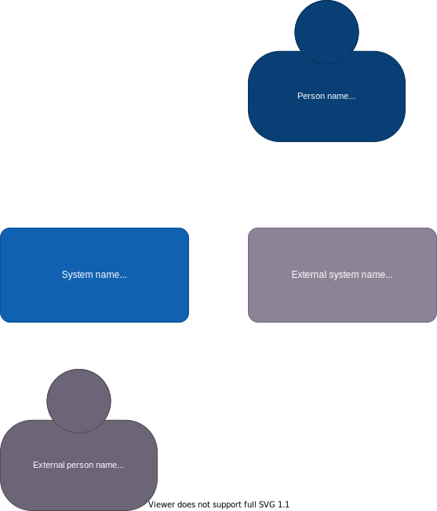

# World of Webcraft

Развлекательная компания хочет, чтобы MMORPG-шутер от первого лица доставлялся через браузер

## Пользователи: 
- миллионы+ (они надеются)
## Требования:
- пользователи выбирают карту, на которой они хотят играть, а затем сражаются со случайно выбранными игроками примерно одинакового уровня
- игроки могут улучшать своих персонажей навыками/экипировкой, отправив компании деньги
- можно использовать из любого «современного» веб-браузера
- полное погружение (звук, графика и т. д.)
- игроки могут переговариваться с другими игроками, но только с теми, кто находится «в пределах досягаемости»
- игроки могут создавать турниры только по приглашению
- гости могут наблюдать за всеми игроками, не будучи замеченными/взаимодействовать (призраки)
- игроки могут создавать новые карты, оружие и правила
## Дополнительный контекст:
- производительность в играх имеет первостепенное значение, но еще важнее масштабируемость
- если эта игра будет успешной, компания планирует использовать хорошие моменты в качестве основы, которую они смогут продавать.
- самые большие расходы - это высококвалифицированные художники, создающие визуальный вид и ощущение

## Бизнес-драйверы
- нарастить большое кол-во игроков
- привлекать игроков за счет доступности игры (необходим только браузер), за счет игровой составляющей: погружения и высококачественного графического и звукового окружения 

## Бизнес-цель
Создать MMORPG-шутер от первого лица и быстро нарастить количество активных игроков до миллионов игроков, зарабатывать на продаже игровой экипировки и навыков

## Стейкхолдеры
Заинтересованные стороны, ключевые участники:
- игроки  
пользователи принимающие активное участие в сражениях на картах
- гости (наблюдатели)  
пользователи наблюдающие за прохождением сражения на какой-то карте без возможности как-либо взаимодействовать с игроками на данной карте. гостю нет необходимости регистрироваться
- художники (гейм-дизайнеры)  
пользователи, которые создают игровое окружение, карты, оружие, экипировку и игровые правила

## Пользовательские истории
- UC-1: регистрация игрока:  
  игрок создает и сохраняет свой профиль, логин пароль и возможно привязывает кредитную карту
- UC-2: авторизация игрока:  
  для доступа к игре игрок заходит на страницу игры и вводит свои пароль и логин
- UC-3: выбор боевой карты:
  игрок из представленных карт выбирает нужную и присоединяется к сражению на этой карте
- UC-4: управление навыками/экипировкой игрового персонажа:  
  игрок изменяет/улучшает навыки/экипировку игрового персонажа
- UC-5: покупка навыков/экипировки для игрового персонажа:  
  игрок улучшает навыки игрового персонажа или покупает экипировку для него за реальные деньги которые списывает с привязанной кредитной карты
- UC-6: участие в сражении на карте
  на карте игрок может сражаться с другими игроками получая какие-то профиты (экипировку/опыт/игровую валюту)
- UC-7: переговоры между игроками:  
  игроки на одной карте могут переговариваться между собой используя текстовый и/или голосовой чат
- UC-8: создание турнира  
  игрок создает турнир со своими правилами и приглашает туда других игроков
- UC-9: создание игрового окружения  
  игроки и художники создают собственные карты, оружие, экипировку, игровые правила, которые можно использовать для сражений
- UC-10: наблюдение за сражением  
  пользователи присоединяются к сражению на карте в качестве гостя без возможности взаимодействовать с другими игроками  

## Базовые атрибуты качества

- быстрое наращивание максимального поддерживаемого кол-ва игроков 
- игроки не должны ощущать "фризов" во время сражений на картах
- высокая доступность игровых сервисов
- высокое качество и проработка игрового мира 
- личная информация клиентов и кредитные карты должны храниться в безопасности

## Бизнес контекст

## Критические сценарии и характеристики

### Критичные сценарии
- UC-4: управление навыками/экипировкой игрового персонажа
- UC-6: участие в сражении на карте
- UC-7: переговоры между игроками
- UC-9: создание игрового окружения

### Критичные характеристики
- быстрая масштабируемость
- высокая производительность
- высокая доступность игровых сервисов (необходимо ориентироваться на 99,9%)
- время ответа на действия игрока при сражении на игровой карте не более 20 миллисекунд
- при разработке большинство ресурсов направляется на создание и проработку геймплея, визуальный вид и ощущение от игры

## Архитектурное решение 1
### Контекст
Для игрового сервиса необходимо определиться с
архитектурным подходом.

### Альтернативы
- Альтернатива 1. Монолит
- Альтернатива 2. Модульный монолит
- Альтернатива 3. Микросервисный подход

### Оценка и сравнительный анализ

|                    | Монолит | Модульный монолит | Микросервисный подход |
|--------------------|---------|-------------------|-----------------------|
| Доступность        | -       | -                 | ++                    |
| Производительность | ++      | ++                | ++                    |
| Масштабируемость   | --      | +                 | ++                    |
| Модифицируемость   | 0       | +                 | ++                    |

### Решение
Наилучшим сочетанием значений критических характеристик достигается при микросервисном подходе к архитектуре. 
Кроме того при успешности данной игры компания может легко использовать микросервисы в качестве основы, которую они смогут продавать

## Архитектурное решение 2
### Контекст
Для игры необходим высокопроизводительный игровой движок способный передать визуальный вид и ощущения от игры которые разработают художники.

### Альтернативы
- Альтернатива 1. Разработка собственного игрового движка
- Альтернатива 2. Покупка подходящего готового движка

### Оценка и сравнительный анализ

|                     | Собственный движок | Сторонний движок |
|---------------------|--------------------|------------------|
| Затраты на движок   | ---                | -                |
| Время на разработку | ---                | +                |

### Решение
Компания ограничила ресурсы на разработку, в том числе и собственного игрового движка, поэтому 
наилучшим выбором будет использование стороннего. 
Обычно с игровым движком поставляются средства/утилиты для разработки игрового мира, 
что тоже является плюсом так как художники смогут сразу использовать эти средства работая с конечным представлением 
своих данных. Это избавит художников от необходимости хранить свои наработки в промежуточном формате, а затем переводить в формат 
собственного движка. 

## Архитектурное решение 3
### Контекст
Необходимо определить, где будет отрисовываться игровая картинка.

### Альтернативы
- Альтернатива 1. На стороне браузера
- Альтернатива 2. На стороне сервера

### Оценка и сравнительный анализ
**Альтернатива 1.** На стороне браузера
- в этом случае между браузером и сервером будет передаваться на порядок меньше данных, 
что обеспечит лучший отклик игрового мира на действия игрока
- также данный подход снизит нагрузку на игровые сервера и снизит требования к ним по производительности
- качество визуальной составляющей будет зависеть от производительности компьютера игрока, что может уменьшить
кол-во желающих играть в данную игру 

**Альтернатива 2.** На стороне сервера
- в этом случае между браузером и клиентом будет передаваться большой поток данных,
  что ограничит пользователей с плохими каналами связи
- на серверной стороне будет необходимо размещать специальные высокопроизводительные сервисы для отрисовки игровой картинке
- качество визуальной составляющей будет постоянным и высоким, при этом игра будет доступна на любой 
низкопроизводительной платформе  

### Решение
Компания склоняется к варианту с отрисовкой игровой картинки в браузере игрока. Это снизит порог доступа для игроков
с плохими каналами связи, снизит отклик игровой системы на действия игрока, снизит расходы на высокопроизводительное 
серверное оборудование.  
Но необходимо проработать риск:
- имеются ли готовые игровые движки работающие в современных браузерах и отрисовывающие картинку такого качества
которого хотели бы достичь художники (игровые-дизайнеры).

