# Tales Of A Fourth Grade

Компания хочет предложить школьным округам комплексную систему управления учащимися в качестве услуги

## Пользователи: 
- преподаватели
- сотрудники 
- родители учащихся

## Требования:
- отслеживать пропуски занятий, опоздания и отговорки (вводится родителями, преподавателями или сотрудниками)
- управлять от 1000 до 1 миллиона студентов
- генерировать отчеты о деятельности учащихся
- быть доступным с игровой площадки (не совсем понятно что это такое the playground)
- отслеживать оценки и задания учащихся (выполненные и подлежащие выполнению)
- форумы родителей и учителей
- работать как система SaaS из хостинг-центра
- должны соблюдать правила безопасности 212FERPA (Закон о правах семьи на образование и конфиденциальность), которые можно найти по адресу (https://www2.ed.gov/policy/gen/guid/fpco/ferpa/index.html).
 
## Дополнительный контекст:
- компания планирует провести агрессивную национальную кампанию продаж
- текущий конкурент пострадал из-за утечки данных
- новый ИТ-директор
- основной маркетинговый ход заключается в гибкости, настраиваемости и (недавно добавленной) безопасности.

## Бизнес-драйверы
- показать пользователям о минимальных затратах за счет того, что нет необходимости поддерживать инфраструктуру
- показать пользователям, что основной упор делается на безопасности

## Бизнес-цель
- за счет падения доверия к конкуренту и агрессивной компании продаж захватить большую часть рынка таких систем

## Стейкхолдеры
Заинтересованные стороны, ключевые участники:
- преподаватели  
пользователи системы выставляющие учащимся оценки, заполняющие журнал посещаемости, создавать и читать сообщения на форумах 
- сотрудники  
пользователи системы ведущие административную работу по управлению учащимися в системе, создание и архивация профилей учащихся, учителей, родителей, 
заполняющие журнал посещаемости учащихся, создание и модерирование сообщений на форумах
- учащиеся  
  пользователи системы имеющие возможность просмотра информации об домашних заданиях, оценках и посещаемости учащегося
- родители учащихся  
пользователи системы имеющие возможность просмотра информации об оценках и посещаемости конкретного учащегося, создавать и читать сообщения на форумах учителей

## Пользовательские истории
- UC-1: регистрация учащихся, родителей, учителей:  
я как сотрудник хочу иметь возможность регистрировать других пользователей (учащихся, родителей, учителей)  
поэтому я   
  1. захожу в раздел управления пользователями
  2. ввожу данные о новом пользователе
  3. нажимаю кнопку Добавить 
- UC-2: авторизация в системе:  
я как пользователь хочу получить доступ к функциональности системы  
поэтому я 
  1. захожу на страницу авторизации 
  2. ввожу свой логин и пароль
  3. нажимаю кнопку Войти
- UC-3: регистрация присутствия учащихся на занятиях:  
я как сотрудник или учитель хочу иметь возможность добавлять в жарнал посещения отметки о присутствии с коментариями  
поэтому я
  1. перехожу в журнал посещений
  2. нахожу класс в котором учиться учащийся
  3. нахожу в списке учащегося
  4. нахожу текущую дату
  5. изменяю состояние с "отсутствовал" на "присутствовал" или "опоздал"
  6. (опционально) добавляю текстовый комментарий 
- UC-4: просмотр сведений о присутствии учащихся на занятиях:  
я как пользователь данной системы хочу посмотреть посещаемость выбранного учащегося  
поэтому я 
  1. перехожу в журнал посещений
  2. нахожу класс в котором учиться учащийся
  3. нахожу в списке учащегося
  4. вижу журнал посещений данного учащего 
  5. имею возможность чтения оставленных комментариев
- UC-5: генерация отчетов о деятельности по ученику за какой-либо промежуток времени:  
я как родитель или учитель хочу получить сводный отчет по учащемуся состоящий статистики 
по предметам которые он изучает и статистики по посещениям этих предметов  
для этого я  
  1. захожу на страницу учащегося
  2. выбираю раздел отчет 
  3. выбираю интервал времени на основе которого необходимо получить отчет
  4. нажимаю кнопку Получить отчет
- UC-6: формирование домашних заданий:  
я как учитель хочу задавать домашнее задание какому-либо классу и назначать срок выполнения  
для этого я  
  1. захожу в раздел Домашних заданий
  2. выбираю класс и предмет по которому хочу задать домашнее задание
  3. в текстовом виде описываю домашнее задание
  4. (опционально) прикрепляю к домашнему заданию необходимые файлы
  5. задаю срок сдачи домашнего задания
  6. нажимаю кнопку Сохранить
- UC-7: добавление выполненного домашнего задания:  
я как учащийся хочу передать домашнее задание для оценки  
для этого я  
  1. захожу в раздел домашних заданий 
  2. выбираю предмет и тему выполненного домашнего задания
  3. прикрепляю файлы с выполненым домашним заданием
  4. нажимаю кнопку Отправить для оценки
- UC-8: оценивание домашних заданий:  
я как учитель хочу иметь возможность оценивать домашние задания  
для этого я  
  1. захожу в раздел домашних заданий
  2. выбираю домашнее задание помеченное для проверки
  3. загружаю или просматриваю встроенным редактором домашнее задание
  4. оцениваю домашнее задание
- UC-9: просмотр состояния домашних заданий:  
я как учащийся или родитель хочу просматривать домашние задания учащегося и его состояния  
для этого я  
  1. захожу в раздел домашних заданий
  2. выбираю учащегося
  3. получаю список домашних заданий и их состояние "не выполнен", "на проверке", "выполнен и оценен" 
- UC-10: создание раздела, темы, поста на форуме
я как учитель для обсуждения вопросов связанных с учебой, хочу создать раздел или тему или пост на форуме  
для этого я  
  1. перехожу на раздел форума
  2. создаю раздел например "Курс Биологии 5 класс"
  3. создаю тему например "Лиственные растения"
  4. создаю текстовый пост
  5. (опционально) прикрепляю файлы
  6. (опционально) указываю учащихся с обязательным уведомлением о создании данного поста
  7. нажимаю кнопку Создать
- UC-11: подписка на разделы и темы форума:  
я как пользователь хочу чтобы меня уведомили о новых постах форума  
для этого я  
  1. перехожу на раздел форума
  2. выбираю тему
  3. нажимаю кнопку Подписаться
- UC-12: чтение постов на форуме:  
я как пользователь хочу прочитать пост на форуме  
для этого я  
  1. перехожу на раздел форума
  2. выбираю тему
  3. получаю список из последних опубликованных постов
 

## Базовые атрибуты качества
- безопасность
- гибкость
- настраиваемость

## Бизнес контекст
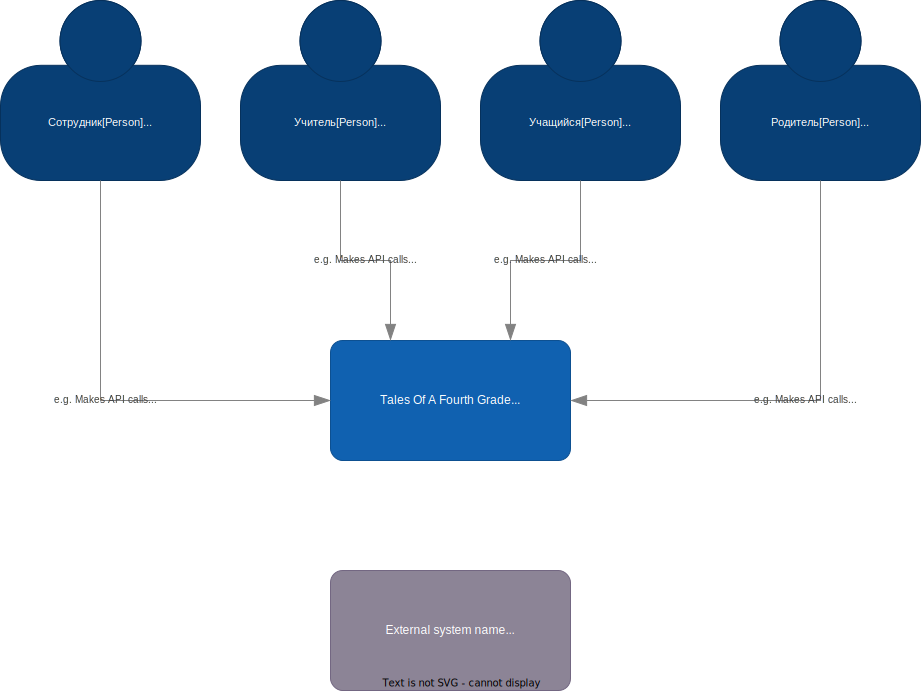

## Критичные сценарии и характеристики

### Критичные сценарии
- UC-6: формирование домашних заданий
- UC-7: добавление выполненного домашнего задания
- UC-8: оценивание домашних заданий  
- UC-9: просмотр состояния домашних заданий

### Критичные характеристики
- безопасность данных
- масштабируемость до более чем 3 000 000 миллиона пользователей
- доступность
- модифицируемость

## Архитектурное решение 1
### Контекст
Для игрового сервиса необходимо определиться с
архитектурным подходом.

### Альтернативы
- Альтернатива 1. Монолит
- Альтернатива 2. Модульный монолит
- Альтернатива 3. Микросервисный подход

### Оценка и сравнительный анализ

|                      | Монолит | Модульный монолит | Микросервисный подход |
|----------------------|---------|-------------------|-----------------------|
| Доступность          | -       | -                 | ++                    |
| Масштабируемость     | --      | +                 | ++                    |
| Модифицируемость     | 0       | +                 | ++                    |

### Решение
Наилучшим сочетанием значений критических характеристик достигается при микросервисном подходе к архитектуре.

## Модель предметной области 
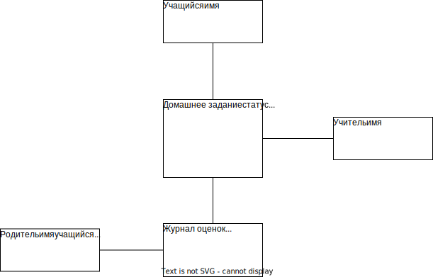  
## Статус Домашнего задания  
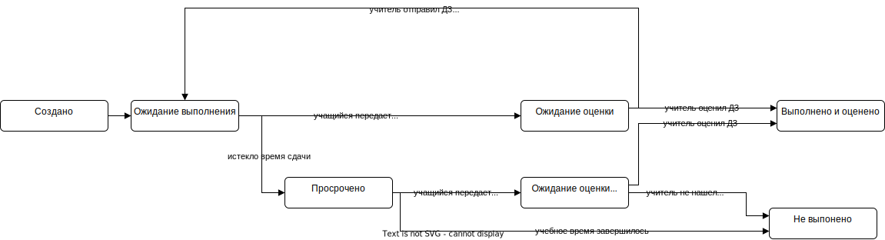
## Функциональная декомпозиция 
## Решение 1
Выделяем контексты  
- Контекст Учителя
- Контекст Учащегося
- Контекст Родителя
- Контекст задачи отслеживания времени выполнения
### Контекст Учителя
#### Модель
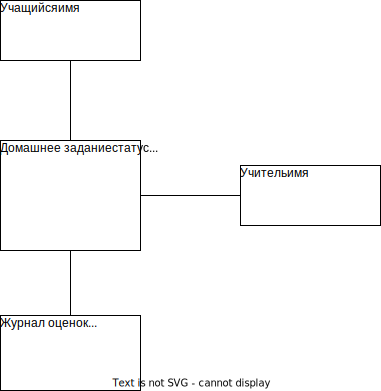  
#### Статус Домашнего задания
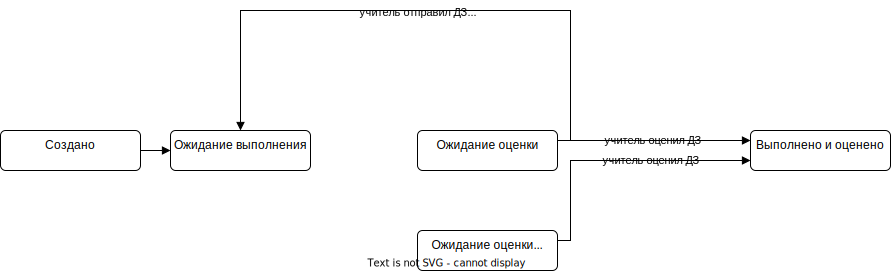
### Контекст Учащегося
#### Модель
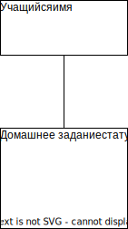  
#### Статус Домашнего задания
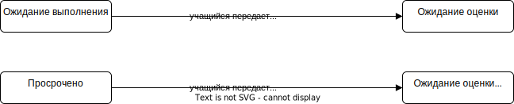
### Контекст Родителя
#### Модель
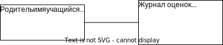
#### Статус Домашнего задания
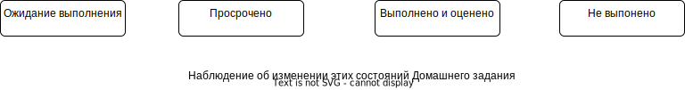
### Контекст задачи отслеживания времени выполнения
#### Модель
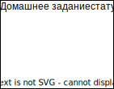  
#### Статус Домашнего задания
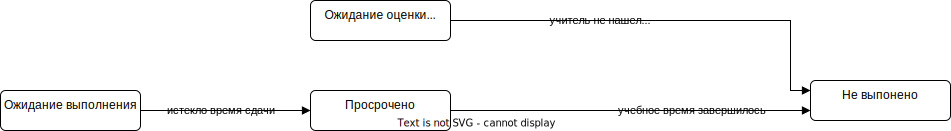  

### Интеграция контекстов
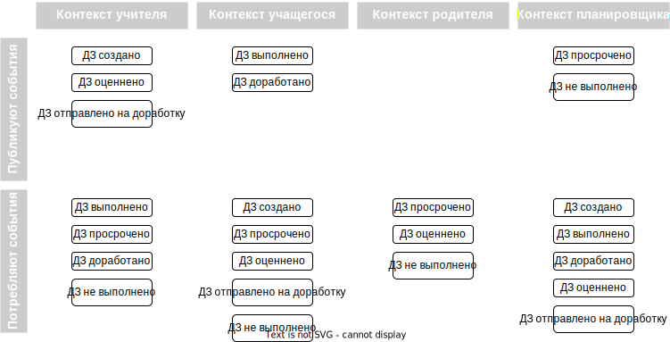

## Решение 2
Каждая сущность реализуется в отдельном модуле  

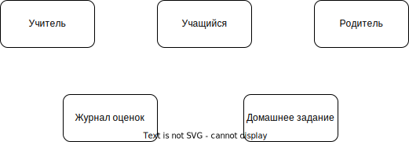

## Сценарии изменения
- Домашнее задание может быть передано на оценку другому Учителю после некоторого 
времени нахождения в состоянии Ожидание оценки
- Родитель может просматривать содержимое Домашнего задания Учащегося
- может быть добавлена история выполнения Домашнего задания
- добавить возможность Учителю переносить дату сдачи
- Учащийся захочет возможность задавать вопросы и получать ответы 
до сдачи Домашнего задания

### Оценка решения 1
- Домашнее задание может быть передано на оценку другому Учителю после некоторого
  времени нахождения в состоянии Ожидание оценки  
  С(Домашнее задание) + С(Учитель)
- Родитель может просматривать содержимое Домашнего задания Учащегося  
  С(Родитель)
- может быть добавлена история выполнения Домашнего задания  
  С(Домашнее задание) 
- добавить возможность Учителю переносить дату сдачи
  С(Домашнее задание) + С(Учитель)
- Учащийся захочет возможность задавать вопросы и получать ответы
  до сдачи Домашнего задания  
  С(Домашнее задание) + С(Учитель) + С(Учащийся)
  

### Оценка решения 2
- Домашнее задание может быть передано на оценку другому Учителю после некоторого
  времени нахождения в состоянии Ожидание оценки  
  С(Домашнее задание) + С(Учитель)
- Родитель может просматривать содержимое Домашнего задания Учащегося  
  С(Родитель)
- может быть добавлена история выполнения Домашнего задания  
  С(Домашнее задание) + С(Учитель) + С(Учащийся) + С(Родитель)
- добавить возможность Учителю переносить дату сдачи  
  С(Домашнее задание) + С(Учитель)
- Учащийся захочет возможность задавать вопросы и получать ответы
  до сдачи Домашнего задания  
  С(Домашнее задание) + С(Учитель) + С(Учащийся)

### Сравнительный анализ

В Домашнем задании кроется много бизнес логики, которая с большой вероятностью будет 
изменяться и расширяться в новых контекстах, поэтому решение 1 выглядит более 
предпочтительным, так как приведет к меньшим согласованным изменениям и соответственно
меньшей стоимости изменений.

