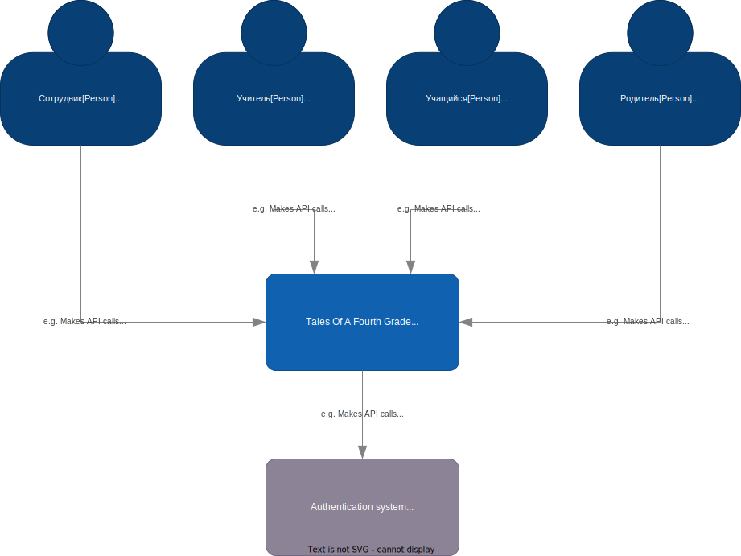
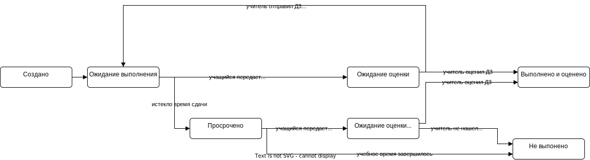

# Tales Of A Fourth Grade

Задание выполняю на основе системы из предыдущего задания

## Бизнес контекст

## Критичные сценарии и характеристики

### Критичные сценарии
- UC-6: Формирование домашнего задания
- UC-7: Добавление выполненного домашнего задания
- UC-8: Оценивание домашнего задания  
- UC-9: Просмотр состояния домашних заданий

## Модель предметной области 
  
## Статус Домашнего задания  

## Функциональная декомпозиция 
Выделены следующие контексты  
- Контекст Учителя
- Контекст Учащегося
- Контекст Родителя
- Контекст задачи отслеживания времени выполнения  

Каждый контекст реализуется отдельным сервисом
### Интеграция контекстов

## Диаграмма контейнеров

## Диаграмма последовательности для критического сценария "UC-6: Формирование домашнего задания"

## Оценка атрибутов качества

