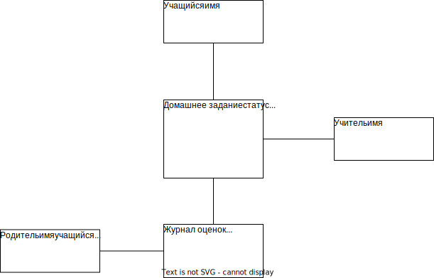
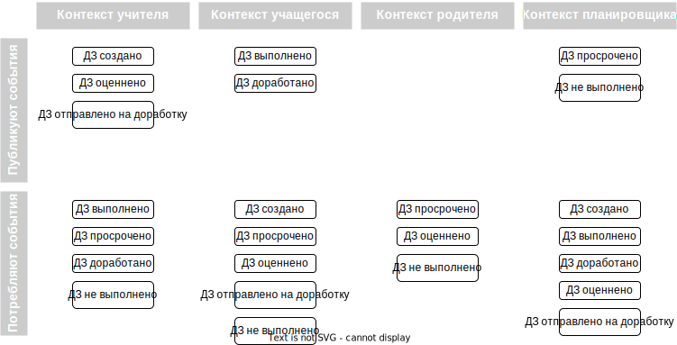

# Tales Of A Fourth Grade

Задание выполняю на основе системы из предыдущего задания

## Бизнес контекст

## Критичные сценарии и характеристики

### Критичные сценарии
- UC-6: Формирование домашнего задания
- UC-7: Добавление выполненного домашнего задания
- UC-8: Оценивание домашнего задания  
- UC-9: Просмотр состояния домашних заданий

## Модель предметной области 
  
## Статус Домашнего задания  

## Функциональная декомпозиция 
Выделены следующие контексты  
- Контекст Учителя
- Контекст Учащегося
- Контекст Родителя
- Контекст задачи отслеживания времени выполнения  

Каждый контекст реализуется отдельным сервисом
### Интеграция контекстов

## Диаграмма контейнеров

## Диаграмма последовательности для критического сценария "UC-6: Формирование домашнего задания"

## Оценка атрибутов качества

### Производительность
Производительность данного сценария можно оценить через время ответа (Latency).
T(учителя) = T(gateway) + T(Сервис Учителя) + T(БД Сервиса Учителя) + T(Очередь событий)

### Надежность
#### Сценарий отказа 1  
Очередь событий недоступна  
##### Решение 1
- откатить изменения в БД Сервиса Учителя
- вернуть пользователю ошибку
##### Решение 2
- сделать в БД Сервиса Учителя таблицу с неотправленными событиями
- при восстановлении доступности Очереди событий отправить все накопившиеся события
#### Сценарий отказа 2
При обработке события "БД Сервиса Учащегося" и/или "БД Планировщика времени выполнения" недоступны
##### Решение 1
Организовать в "Очереди событий" несколько очередей с отложенной по времени отправкой.  
При недоступности БД переложить событие в одну из этих очередей с подходящим таймаутом (Retray pattern).
##### Решение 2
Организовать в "Очереди событий" несколько очередей с отложенной по времени отправкой.  
В "Сервис Учащегося" и "Планировщик времени выполнения" в подсистему обработки событий добавить реализацию Circuit Breaker.   
При недоступности БД не обрабатывать события вызывая повторную отправку самой "Очередью Событий".
#### Сценарий отказа 3
Повторное получение события о "Создании домашнего задания" 
##### Решение 1
Ввести уникальный идентификатор для каждого события. 
При обработке события сохранять, что событие с данным идентификатором уже обработано 
и повторном получении просто откидывать его.
##### Решение 2
Уникальный идентификатор у "Домашнего задания". Если "Домашнее задание" с данным 
идентификатором уже сохранено, то не обрабатывать данное событие.

### Масштабируемость
При увеличении нагрузки "Сервис Учителя" возможно горизонтально масштабировать добавлением новых нод.
С масштабированием "БД Сервиса Учителя" уже сложней. Здесь будет зависеть от того способна ли  
выбранная СУБД горизонтально масштабироваться, при неспособности прийдется увеличивать производительность 
за счет миграции на более производительное "железо". API gateway, в добавок, будет играть роль балансировщика 
и тоже хорошо масштабируется горизонтально.

### Информационная безопасность
Точка входа в приложение одна, через API gateway, который обеспечивает аутентификацию и авторизацию пользователей.
Внутри системы взаимодействие сервисов строится без аутентификации/идентификации.
Для повышения уровня безопасности можно использовать готовый Identity Provider и настроить взаимодействие
API gateway с данным сервисом и построить взаимодействие сервисов внутри системы с Zero Trust подходом.  

